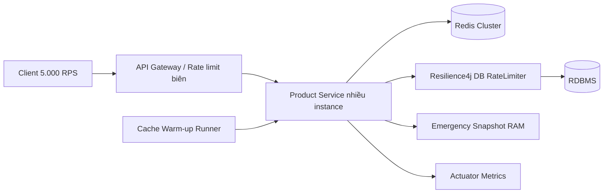
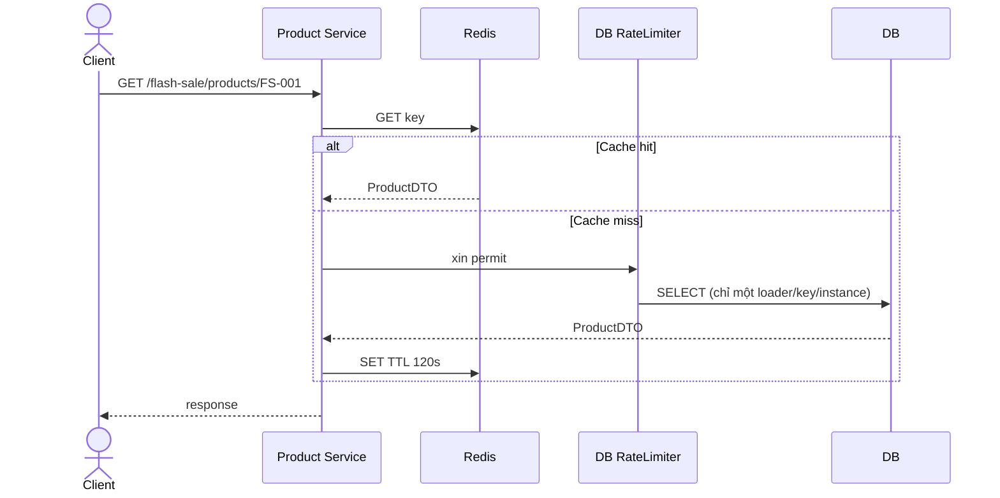

# SS16_HW05 - Hệ thống Flash Sale chống sập

## 1. Kiến trúc tổng thể



Các module chức năng:

- **API Gateway**: giới hạn tổng lưu lượng, xác thực và phân phối request đến nhiều Product Service.
- **Product Service**: API đọc sản phẩm, dùng Spring Cache và `@Cacheable(sync=true)`.
- **Redis Cache**: lớp đọc nhanh dùng chung giữa các instance, TTL 120 giây.
- **Cache Warm-up Worker**: nạp trước các sản phẩm Flash Sale khi ứng dụng khởi động.
- **Resilience4j RateLimiter**: giới hạn tối đa 50 lượt/giây từ một instance xuống DB khi cache không dùng được.
- **Emergency Snapshot**: bản sao RAM gần nhất để trả response degraded khi RateLimiter từ chối.
- **Actuator Metrics**: quan sát health, latency, RateLimiter và số request.

## 2. Luồng request bình thường



Cache hit không chạm DB. Cache miss đi qua `DatabaseFallbackService`, là bean riêng có `@RateLimiter`. Việc tách bean rất quan trọng: nếu method rate-limited được tự gọi trong cùng class, lời gọi không đi qua Spring AOP proxy và annotation không có tác dụng.

## 3. Chống Cache Stampede

`@Cacheable(sync = true)` làm cho các request cùng key trong **một instance** dùng chung một cache loader. Khi 10.000 request đồng thời vào `FS-001` vừa hết hạn, request đầu tiên được thực thi method; các request còn lại chờ kết quả thay vì đồng loạt SELECT DB.

Giới hạn cần hiểu rõ: `sync=true` không tạo distributed lock giữa nhiều instance Product Service. Nếu có 20 instance, về lý thuyết vẫn có tối đa khoảng 20 loader cùng xuống DB. Vì vậy kiến trúc còn có:

1. Redis dùng chung và TTL có jitter trong production để key không hết hạn cùng lúc.
2. RateLimiter trước DB để đặt trần tải.
3. Có thể bổ sung distributed lock Redis (`SET NX`) hoặc thư viện single-flight liên instance cho key cực nóng.
4. Connection pool DB phải có giới hạn, không tăng vô hạn theo lượng request.

## 4. Chống Cold Start bằng Warm-up

`CacheWarmupRunner` chạy sau `DataInitializer`. Runner lấy danh sách sản phẩm `flashSale=true`, sau đó gọi **qua bean `FlashSaleProductService`** để annotation cache vẫn được áp dụng. Ba sản phẩm mẫu được nạp vào Redis trước khi ứng dụng nhận tải Flash Sale.

Trong production, warm-up nên là job riêng chạy trước giờ mở bán, có giới hạn concurrency, retry và metric tỷ lệ thành công. Chỉ warm các SKU dự kiến nóng; nạp toàn bộ catalog vừa chậm vừa lãng phí RAM Redis.

## 5. Redis Down và Degraded Mode

Khi Redis GET lỗi, `CacheErrorHandler` không làm request thất bại mà cho luồng tiếp tục như cache miss. Mọi truy vấn DB phải qua RateLimiter `databaseFallback`:

- Tối đa 50 request mỗi giây trên mỗi instance.
- `timeout-duration=0`: không xếp hàng dài làm cạn thread.
- Request có permit đọc DB và cập nhật Emergency Snapshot.
- Request bị từ chối dùng snapshot RAM gần nhất, response có `degraded=true`.
- Nếu chưa từng có snapshot, API trả HTTP 503 rõ ràng thay vì tiếp tục ép DB.

Snapshot có thể cũ nên chỉ phù hợp API hiển thị. Nghiệp vụ đặt hàng/trừ tồn kho vẫn phải kiểm tra atomically tại DB hoặc hệ thống inventory chuyên dụng.

## 6. Tình huống 10.000 request cùng key

Giả sử cache `FS-001` vừa hết hạn:

1. 10.000 request tới API Gateway; gateway loại lưu lượng vượt quota nếu cần.
2. Ở mỗi Product Service, `sync=true` chọn một thread làm loader cho `FS-001`.
3. Loader xin permit RateLimiter rồi SELECT DB.
4. Kết quả được ghi Redis; các thread đang chờ nhận cùng giá trị.
5. Các request sau đó hit Redis với latency thấp.

Nếu Redis đang down, không thể tái tạo cache. RateLimiter giữ số SELECT dưới ngưỡng; phần còn lại nhận snapshot degraded/503. Hệ thống ưu tiên sống sót thay vì cố trả dữ liệu tươi cho mọi request rồi làm sập DB.

## 7. Cấu hình Redis

Cache dùng `Jackson2JsonRedisSerializer`, không Java native serialization. TTL là 120 giây và null không được cache. Connect timeout 500 ms, command timeout 800 ms giúp fail-fast khi Redis gặp sự cố.

TTL production nên cộng jitter ngẫu nhiên, ví dụ 120–150 giây, để nhiều key không hết hạn cùng một thời điểm. Sản phẩm Flash Sale có thể dùng TTL dài hơn nếu giá/tồn kho có cơ chế chủ động invalidate bằng event.

## 8. So sánh hiệu năng

Bảng dưới là tiêu chí nghiệm thu và xu hướng kỳ vọng; số cụ thể phụ thuộc CPU, network, Redis và DB của môi trường chạy:

| Chế độ | DB query/1.000 request cùng key | Latency p95 | Throughput | DB connection/CPU |
|---|---:|---|---|---|
| Không cache | xấp xỉ 1.000 | Cao, tăng theo hàng đợi DB | Thấp | Dễ đầy pool, CPU cao |
| Cache miss không sync | Có thể hàng trăm | Spike lớn lúc TTL hết | Dao động | Nguy cơ stampede |
| `sync=true` + Redis | xấp xỉ 1 mỗi instance | Một nhóm chờ loader, sau đó thấp | Cao | Thấp và ổn định |
| Redis down + RateLimiter | tối đa 50/giây/instance | Snapshot thấp; DB request cao hơn | Có kiểm soát | Không vượt trần cấu hình |

Để đo cục bộ sau khi warm-up:

```bash
ab -n 5000 -c 200 http://localhost:8080/api/flash-sale/products/FS-001
```

Cần thu thập `Requests per second`, `Time per request`, p95/p99, Hikari active connections và CPU DB. Không dùng kết quả laptop để cam kết 5.000 RPS production; phải load test trên hạ tầng gần giống thật.

Kết quả đo cục bộ của bản nộp sau warm-up (`ab -n 5000 -c 200`): **0 request lỗi**, khoảng **19.446 request/giây**, mean latency **10,285 ms** theo nhóm concurrency và p95 **19 ms**. Đây chỉ là phép đo loopback với H2/Redis local, dùng để chứng minh cache hit chịu được mức 5.000 RPS trong môi trường demo, không phải SLA production.

## 9. Chạy dự án

```bash
docker compose up -d
./gradlew clean test
./gradlew bootRun
```

Test tải nhanh:

```bash
chmod +x demo/load-test.sh
./demo/load-test.sh http://localhost:8080/api/flash-sale/products/FS-001 1000 100
```

Các URL hữu ích:

```text
GET /api/flash-sale/products/FS-001
GET /actuator/health
GET /actuator/metrics
GET /actuator/metrics/resilience4j.ratelimiter.available.permissions
```

## 10. Test và giới hạn demo

Test tự động xác nhận `sync=true`, cache miss được chuyển sang bean rate-limited và snapshot fallback được đánh dấu degraded. H2 và snapshot RAM giúp demo gọn; production cần Redis Cluster/Sentinel, database thật, gateway rate limit phân tán, tracing, dashboard và load test nhiều instance.

## 11. Kết luận

Không một kỹ thuật đơn lẻ chống được Flash Sale. Warm-up xử lý Cold Start, `sync=true` thu hẹp stampede trong từng instance, Redis hấp thụ lượng đọc, RateLimiter bảo vệ DB khi cache hỏng và snapshot cung cấp degraded mode. Các lớp này phối hợp để hệ thống suy giảm có kiểm soát thay vì sập dây chuyền.
